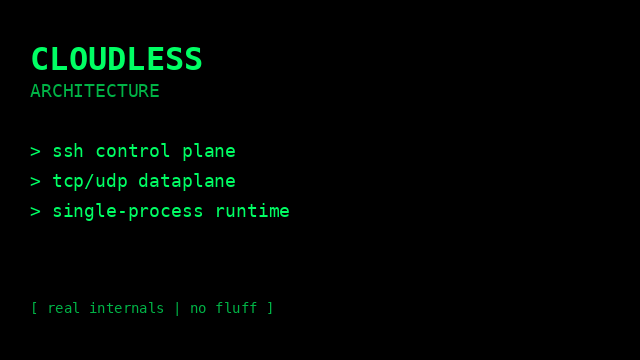

# 🚀 Cloudless 

Expose your local services to the internet using SSH — with zero ambiguity.

## What is Cloudless

Cloudless is a high-performance tunneling system that lets you publish services with a simple SSH command.

✨ Designed to be:
- deterministic
- explicit
- safe by construction

No hidden behavior. No implicit routing. No surprises.

## ⚡ Quick start

```bash
ssh -R :443:localhost:8080 up@cloudless.site
```

→ your service is now available via HTTPS.

## Two modes

### 🌐 `up@` → zero-config publish

```bash
ssh -R :443:localhost:8080 up@cloudless.site
```

- HTTPS gadget
- automatic backend detection when needed
- instant exposure

### 🔧 `tunnel@` → full control

```bash
ssh -R tcp:22:localhost:22 tunnel@cloudless.site
```

Supports:
- raw TCP
- raw UDP
- HTTPS proxy on Cloudless domains
- full custom domains in passthrough mode

## 🧠 Core idea

Cloudless separates:

```text
public endpoint ≠ backend service
```

- `-R` defines only the public side
- backend metadata comes from:
  - hint (explicit)
  - or probe (automatic, only where applicable)

## 🧩 Service model

| Type | Behavior |
|------|----------|
| TCP / UDP | raw tunnel |
| HTTPS on Cloudless domain | proxy |
| Full custom domain | passthrough |

## 💡 Why Cloudless

Compared to typical tunneling tools, Cloudless is built around explicit routing decisions.

| Feature | Cloudless | Typical tools |
|--------|----------|---------------|
| Deterministic routing | ✅ | often implicit |
| No backend derived from `-R` | ✅ | often mixed |
| No post-create mutation | ✅ | often dynamic |
| Clear proxy vs passthrough model | ✅ | often blurred |

## 🎥 Architecture Deep Dive

[](https://github.com/Cloudless-site/cloudless/raw/main/docs/video/cloudless.mp4)

*real internals · no slides · no fluff*

## 📚 Documentation

- 📘 [User Manual](docs/README-USER.md)
- 📖 [How Works](docs/HOW-CLOUDLESS-WORKS.md)
- 🏗️ [Architecture](docs/ARCHITECTURE.md)
- 🔎 [Scoutless Doc](https://github.com/Cloudless-site/scoutless)

## 💻 Clients

- 📱 [Android App](android/apk/cloudless.apk) zero-effort app for local discovery and tunnel launch
- 🔎 [Scoutless](https://github.com/Cloudless-site/scoutless/tree/main/bin/scoutless) network discovery client  binaries
- 🪁 [Kite](bin/kite)  UDP adapter client binaries

⚠️  Public Service

Cloudless provides a public endpoint service.

- free for testing and evaluation
- no uptime or availability guarantees
- limits may be introduced at any time

You expose it. You own it.

## 🎸 Philosophy

Cloudless follows one invariant:

> Public exposure is independent from backend implementation.

Everything else derives from this.

## 🚧 Status

Actively developed. Focused on correctness over convenience.
