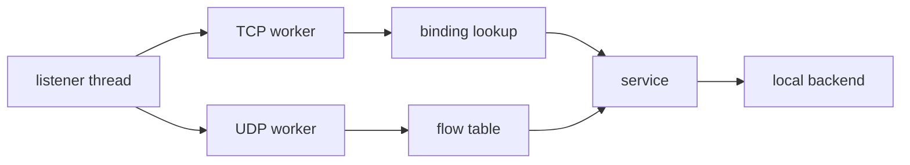

# Dataplane Overview

The dataplane is responsible for forwarding network traffic.

Components

TCP workers
handle TCP forwarding using epoll.

UDP workers
handle UDP flows and maintain flow tables.

Bindings

incoming packets are mapped to services using runtime bindings.

Design rule

the dataplane contains no policy logic.

## Dataplane Flow Diagram

Dataplane uses defensive teardown:
- shutdown delayed until buffers drained
- conn_map invalidated before close
- mailbox fallback on saturation