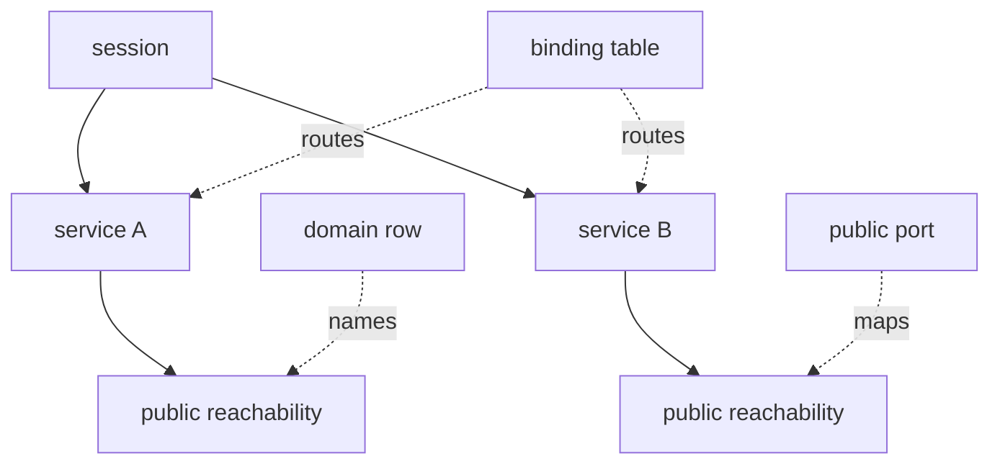
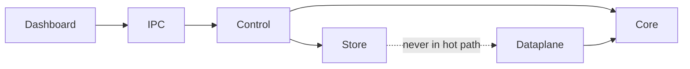

# Cloudless Models and Contracts

CANONICAL MODEL

session -> service

SESSION

Represents an authenticated SSH connection.

SERVICE

Canonical representation of an exposed local service. Public reachability is derived from service type and routing state.

DOMAIN

Naming resource attached to HTTP/HTTPS services. Not a first-class runtime entity in the core model.

PUBLIC REACHABILITY

Derived view of a service: domain for HTTP/HTTPS, public port for TCP/UDP.

BINDING

Runtime lookup entry used by dataplane.

MODULE CONTRACTS

CORE
Maintains runtime model.

CONTROL
Implements control plane.

DATAPLANE
High performance packet forwarding.

STORE
Persistence layer.

DASHBOARD
External API layer.

DESIGN CONTRACTS

service is the central entity
domain must not replace service
public reachability is derived from service state
binding must remain runtime lookup
dataplane must remain policy free
control plane mutates the model

## Contract Diagrams

### Entity ownership

### Layer contract

RUNTIME INVARIANTS

sleeve is the single IPC client of the core backend
core ipc remains single-client by design
worker-owned fd must be closed by owner worker only
per-session tcp conn lists are mutated by tcp worker only
per-session udp flow lists are mutated by udp worker only
hot structs are frozen by static asserts
shutdown order is ssh/control -> sessions -> listeners -> workers -> static/ipc/qjs -> db
seccomp modes are split by role: accept, main/control, tcp worker, udp worker
dashboard must not expose reserved verbs before backend implementation

## Workspace Layout

Project sources live in `cloudless/`. Persistent local artifacts live in `../cloudless-permanent/`.

Keep in `cloudless/`:
- sources
- headers
- dashboard
- web
- docs
- hooks
- mk files

Keep in `cloudless-permanent/`:
- dropbear tree
- build outputs
- binaries
- downloads