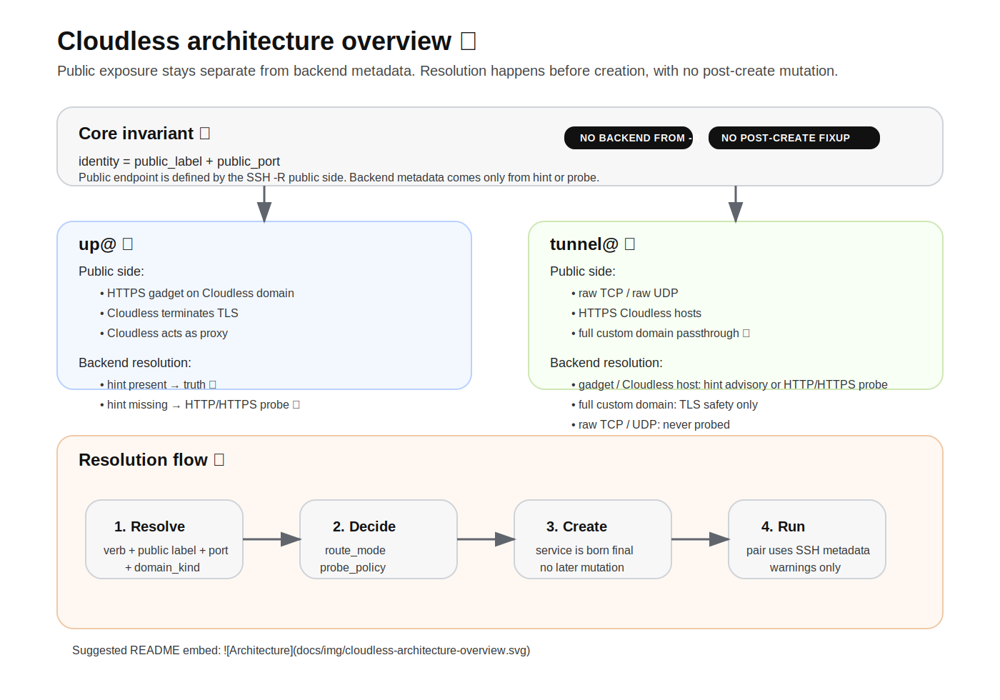

# HOW CLOUDLESS WORKS 🚀



## What is Cloudless

Cloudless is a tunneling system that exposes local services through SSH in a deterministic way.

✨ Key principles:
- no ambiguity
- no hidden behavior
- strict separation between public side and backend metadata

## Core idea 🧠

Every service is identified by:

`public_label + public_port`

Examples:
- `https + 443`
- `tcp + 22`
- `udp + 53`

This identity is stable and explicit.

## Public vs backend ⚠️

Cloudless enforces a strict rule:

`Public endpoint ≠ Backend service`

- `-R` defines only the public side
- backend metadata comes from:
  - hint ✅
  - probe 🔍

Cloudless does not:
- derive backend metadata from `-R`
- rewrite backend metadata after service creation
- guess hidden fallbacks at runtime

## Two modes 🔀

### `up@`

```bash
ssh -R :443:localhost:8080 up@cloudless.site
```

- public endpoint is always a Cloudless HTTPS gadget 🌐
- Cloudless terminates TLS
- Cloudless acts as proxy

Backend resolution:
- hint present → truth
- hint missing → HTTP/HTTPS probe

### `tunnel@`

```bash
ssh -R tcp:22:localhost:22 tunnel@cloudless.site
```

Supports:
- raw TCP 🔌
- raw UDP 📡
- HTTPS on Cloudless hosts
- full custom domains in passthrough mode 🔒

Backend resolution depends on service type.

## Service types 📦

### 1. RAW (`tcp` / `udp`)

- no proxy
- no TLS termination
- no probe
- direct tunnel semantics

Hints for raw services are informational only.

### 2. Cloudless HTTPS (gadget or Cloudless host)

- public endpoint is HTTPS
- TLS is terminated by Cloudless
- Cloudless proxies to the backend

Backend metadata comes from:
- hint if present
- otherwise HTTP/HTTPS probe

### 3. Full custom domain

- always passthrough
- Cloudless does not terminate TLS
- Cloudless does not proxy HTTP
- only TLS safety is checked

## High-level flow 🧭

```mermaid
flowchart TD
    A[SSH session to Cloudless] --> B{Verb}
    B -->|up@| C[HTTPS gadget only]
    B -->|tunnel@| D[Raw TCP/UDP or Cloudless HTTPS host or full custom domain]

    C --> E[identity = public_label + public_port]
    D --> E

    E --> F[Resolve before create]

    F --> G{Hint present?}
    G -->|yes| H[Backend metadata from SSH command line]
    G -->|no, web case| I[HTTP/HTTPS probe]
    G -->|raw| J[No probe]

    H --> K[Create service]
    I --> K
    J --> K

    K --> L[No post-create mutation]

    L --> M[Pair / HTML uses SSH metadata]
    L --> N[Proxy route for Cloudless HTTPS]
    L --> O[Passthrough for full custom domain]
```

## Visual overview 🗺️

### `up@`

```mermaid
flowchart LR
    A[SSH client] --> B[up@]
    B --> C[Cloudless HTTPS gadget]
    C --> D{Hint present?}
    D -->|yes| E[Use hint]
    D -->|no| F[Probe HTTP/HTTPS]
    E --> G[Create service]
    F --> G
    G --> H[Proxy traffic]
```

### `tunnel@`

```mermaid
flowchart LR
    A[SSH client] --> B[tunnel@]
    B --> C{Service kind}
    C -->|tcp / udp| D[Raw tunnel]
    C -->|Cloudless HTTPS host| E[Proxy]
    C -->|Full custom domain| F[Passthrough]
    E --> G{Hint?}
    G -->|yes| H[Use advisory hint]
    G -->|no| I[Probe HTTP/HTTPS]
    F --> J[TLS safety]
```

## Hint format 🧩

Hints describe backend metadata explicitly:

`<label>:<port>#<backend_host>:<backend_port>/svc/<http|https>[;host=...][;sni=...]`

Example:

`https:443#192.168.1.10:8080/svc/http;host=myapp.local`

Meaning:
- backend mode (`http` or `https`)
- backend host and port
- optional HTTP Host rewrite
- optional TLS SNI value

## Probe 🔍

Cloudless probes only when needed.

Cloudless probes:
- HTTP
- HTTPS

Cloudless never probes:
- raw TCP
- raw UDP

Probe results do not rewrite the service model after creation.
They are used to observe compatibility and emit warnings when needed.

## Routing model 🧱

Routing is decided once:

`resolve → create → done`

No:
- runtime mutation
- retroactive fixups
- hidden fallback from public endpoint to backend metadata

## Pair / activation 🔗

Pair and activation views use metadata coming from:
- SSH command line hints

This keeps user-facing information aligned with the declared backend metadata.

## Why Cloudless is different 💡

Typical tunnel tools often mix public exposure and backend assumptions.
Cloudless keeps them separate.

That gives you:
- explicit routing behavior
- deterministic service identity
- clean proxy vs passthrough semantics
- fewer surprising runtime transitions

## Summary 🧾

Cloudless is built around one invariant:

**Public exposure is independent from backend implementation.**

Everything else follows from that rule.
