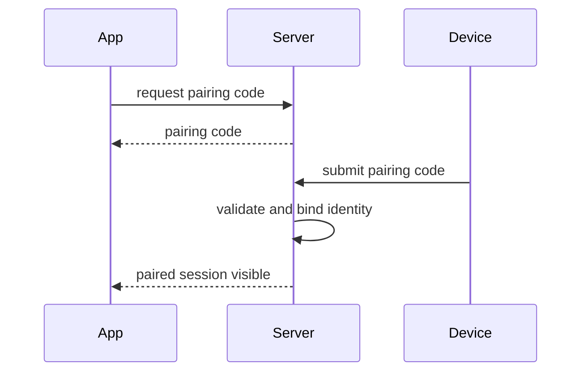

# ☁️ SSH‑First Reverse Proxy & Programmable Edge

**Cloudless** is a programmable reverse proxy and tunnel manager designed for hackers, developers, and sysadmins who believe the User Experience *is* the Protocol.

---

## 🗺️ The "Mental Model"

In Cloudless, the **SSH username is the command** on the control plane and selects the publication model on the tunnel plane.

1.  **Control Plane:** `ssh command@cloudless.site` (e.g., `register`, `ls`, `activate`).
2.  **Tunnel Plane:** `ssh -R ... up@cloudless.site` or `ssh -R ... tunnel@cloudless.site`.
    - `up@` publishes a public HTTPS gadget endpoint.
    - `tunnel@` publishes either raw `tcp` / `udp`, a Cloudless HTTPS endpoint, or a custom full-domain passthrough endpoint.
3.  **Identity:** We track your **SSH Key Fingerprint (SHA256)**. No passwords, no accounts.

---

## 🔎 Reverse Tunnel Parsing Rules

For `ssh -R`, Cloudless parses the left-most bind token before the public port using these mutually exclusive rules:

- `tcp` or `udp` -> reserved raw transport labels
- `https`, `https1`, `https2`, ... -> Cloudless HTTPS gadget labels
- empty token (`-R :443:...`) -> generated Cloudless HTTPS gadget label
- token with no dot (for example `mio`) -> registered Cloudless label, equivalent to `mio.cloudless.site`
- token containing a dot -> explicit hostname (`myapp.cloudless.site` or `gigi.mydomain.site`)

`http` is not a valid public bind label.

Examples:

```bash
ssh -R mio:443:192.168.1.1:554 tunnel@cloudless.site
ssh -R mio.cloudless.site:443:192.168.1.1:554 tunnel@cloudless.site
ssh -R :443:192.168.1.1:554 up@cloudless.site
ssh -R https:443:192.168.1.1:443 up@cloudless.site
ssh -R tcp:10000:192.168.1.10:22 tunnel@cloudless.site
```

`mio` and `mio.cloudless.site` are synonyms for the same registered Cloudless label.

## ⚡ Quick Start: The "Proper" Way

Use `up@` when you want a public Cloudless HTTPS gadget endpoint.
Use `tunnel@` when you want raw `tcp` / `udp`, a registered Cloudless HTTPS endpoint, or a full custom-domain passthrough endpoint.

Before exposing a production service, you typically register a stable Cloudless name (e.g., `myapp.cloudless.site`).

### 1. Register
Reserve a subdomain linked to your SSH key.
```bash
ssh register@cloudless.site myapp.cloudless.site email=me@example.com
```

**Note:** The control-plane CLI parser is intentionally strict: arguments cannot contain spaces and quoting is not supported.
Use simple tokens (`key=value`) and domain names without whitespace.

*You will receive a verification token via email (or hook).*

### 2. Verify
Prove you own the email/request.
```bash
ssh verify@cloudless.site <TOKEN_FROM_EMAIL>
```

### 3. Tunnel (Example: HTTPS Gadget)
Expose your local web backend through a Cloudless HTTPS endpoint.
```bash
ssh -R myapp.cloudless.site:443:localhost:8443 tunnel@cloudless.site
```

Now browse:
- `https://myapp.cloudless.site/`

## 🚀 Fast Demo Paths

Use one of these when you want the shortest useful path instead of a pilgrimage.

- Instant web demo: `ssh -R :443:localhost:3000 up@cloudless.site`
- Stable HTTPS demo: `ssh -R myapp.cloudless.site:443:localhost:8443 tunnel@cloudless.site`
- Controlled TCP demo: `ssh -R tcp:10000:localhost:22 tunnel@cloudless.site` then `ssh activate@cloudless.site` from the consumer machine

---

## 🧩 Gadget Domains: The "Instant" Way

Don't want to register a permanent domain? **You don't have to.**

If you omit the hostname in your SSH tunnel request (for example `-R :443:...`), Cloudless acts as a **Gadget Generator**. It assigns you a random, ephemeral subdomain instantly. No registration, no email, no database record.

**How to use:**
Simply leave the bind token empty (start with a colon `:`) or use a public gadget label such as `https`.

```bash
# Syntax: ssh -R :<remote_port>:<local_host>:<local_port> ...
ssh -R :443:localhost:3000 up@cloudless.site
```

**Output:**
```text
Tunnel Ready: g-x9y2z.cloudless.site -> port 443 (ACTIVE)
```

**Perfect for:** Webhooks, quick demos, and temporary file sharing.
*Note: Gadget domains are ephemeral. If you disconnect, you might lose that specific name forever.*

---

## 🚇 Tunnels: Which Protocol?

Cloudless supports different publication modes. Use the right tunnel mode for your needs.

### 🌐 HTTPS gadget publishing via `up@`
For web servers exposed through a Cloudless HTTPS endpoint. Tunnels become **ACTIVE** immediately upon connection.

- Cloudless terminates TLS
- Cloudless presents its own certificate
- Cloudless proxies to the backend
- if command-line hints are missing, Cloudless probes the backend to distinguish HTTP vs HTTPS

Examples:
```bash
ssh -R :443:localhost:3000 up@cloudless.site
ssh -R https:443:localhost:8443 up@cloudless.site
```

### 🌐 HTTPS publishing via `tunnel@`
For registered Cloudless subdomains and Cloudless HTTPS endpoints exposed through `tunnel@`.

- Cloudless terminates TLS
- Cloudless proxies to the backend
- if command-line hints are missing, Cloudless probes the backend to distinguish HTTP vs HTTPS

Example:
```bash
ssh -R myapp.cloudless.site:443:localhost:8443 tunnel@cloudless.site
```

### 🌍 Full custom domain via `tunnel@`
For bring-your-own-domain passthrough.

- TLS is not terminated by Cloudless
- traffic is passed through end-to-end
- Cloudless keeps TLS safety checks and prints SSH console warnings if the backend is unreachable, mismatched, or fails TLS safety

Example:
```bash
ssh -R app.example.com:443:localhost:443 tunnel@cloudless.site
```

### 🔌 raw TCP via `tunnel@` (TCP)
For databases, SSH, RDP, or custom TCP protocols.

**🛡️ Security Gate:**
To prevent port scanning and abuse, Tunnels start as **INACTIVE (Firewalled)** by default.
The **Consumer** (the person *connecting* to the exposed port) must explicitly authorize their IP address.

#### 1. Host Side (The Provider)
Run this on the machine where the service (e.g., SSH server) is running.
**You must specify the public port you want to use.**

```bash
# Expose local SSH (22) to public port 10000
ssh -R tcp:10000:localhost:22 tunnel@cloudless.site
```

#### 2. Client Side (The Consumer)
Run this on your laptop/remote machine before connecting.
```bash
# Knock to open the firewall for your current IP
ssh activate@cloudless.site
```

Notes:
- `activate@` also starts a live "watch" stream. Keep it open in a terminal.
- Activation is tied to the requesting fingerprint and is associated with the client IP that triggered the activation; it is not a static global allowlist.
- If you disconnect the original tunnel, the service disappears (and traffic stops).

### Activation Model

- Each public port can be associated with a single active consumer at a time.
- Activation is tied to the requesting fingerprint and the client IP that triggered it.
- If multiple activation attempts occur:
  - the latest successful activation overrides the previous one
  - previous consumers are implicitly detached

This behavior is deterministic and intentional.

```bash
# Connect to the service
ssh -p 10000 user@cloudless.site
```

---

## 🪁 UDP Tunnels with `tunnel@` and Kite

Standard SSH has limitations with UDP because it converts packets to a stream. To serve **real UDP applications** (WireGuard, Game Servers, QUIC), use `tunnel@` to reserve the public slot and use **Kite** as the bridge.

**Reference Setup for Examples:**
*   Public Cloud Port: `10000`
*   Gateway Local Exchange (TCP): `4000`
*   IoT Target Device (UDP): `192.168.1.50:5555`

### UDP slot reserved via `tunnel@`, transport bridged through SSH/Kite
Use this if you need traffic to pass through the encrypted SSH channel path to bypass restrictive corporate firewalls.

**1. Host Side (The Provider):**
Start Kite in **SSH Adapter Mode** (no token needed), then create the SSH tunnel.

```bash
# A. Start Kite Bridge (Adapter Mode)
# Listen on Local TCP Port 4000 and forward to your UDP target
./kite 4000:192.168.1.50:5555

# B. Start SSH Tunnel (Forward Public 10000 -> Local 4000)
ssh -R udp:10000:localhost:4000 tunnel@cloudless.site
```

**2. Client Side (The Consumer):**
The remote user must unlock access.
```bash
# A. Activate Identity
ssh activate@cloudless.site
# Note: The activate@ command will stream live logs to confirm activation.
# Keep the terminal open or use Ctrl+C to exit; the authorization persists.

# B. Connect
nc -u cloudless.site 10000
```

**3. Client Side (The Consumer):**
As always with raw ports, the consumer must knock.
```bash
# A. Activate Identity
ssh activate@cloudless.site

# B. Connect (e.g., WireGuard Endpoint)
# Endpoint = cloudless.site:10000
```

---

## 🧠 Programmable Edge (JavaScript)

Upload **QuickJS** scripts to filter traffic, implement firewalls, or log data at the edge.
Scripts run in isolated VMs with strict memory/time budgets.

**1. Write `firewall.js`:**
```javascript
function onOpen(meta) {
  if (meta.client_ip !== '1.2.3.4') {
    throw 'Blocked IP';
  }
}
function onData(dir, chunk) {
  return chunk; // passthrough
}
```

**2. Upload:**
```bash
ssh put@cloudless.site myapp.cloudless.site file=/var/lib/cloudless/staging/firewall.js
```

Upload notes (current build):
- `put@` requires domain ownership **and VERIFIED status**.
- The domain must exist in the DB and be verified before uploading a script.
- Basic safety checks apply: binary/control characters are rejected, and the script must pass a QuickJS syntax check before being published.

**3. Download/Backup:**
```bash
ssh get@cloudless.site myapp.cloudless.site > backup.js
```
**Download notes (current build):**
- `get@` requires domain ownership, but the domain does **not** need to be verified.
- If the script is missing (or permissions are unsafe), `get@` returns an error.

---

## 🛡️ protect@ (Instant Basic Auth / IP Allowlist)

When exposing a dev service (e.g. `localhost:3000`) you often want "instant safety" without changing your app.
`protect@` generates a small QuickJS middleware and injects it as your active script.

### Option A: Basic Auth
```bash
ssh protect@cloudless.site myapp.cloudless.site user=admin pass=secret
```

### Option B: IP Allowlist (single IP)
```bash
ssh protect@cloudless.site myapp.cloudless.site ip=1.2.3.4
```

Notes:
- The control-plane CLI parser is strict: **no spaces and no quoting** in arguments.
Additional constraints (current build):
- `protect@` requires that the domain exists in the DB and is owned by your SSH key.
- `protect@` **overwrites** the current active script for that domain (same mechanism as `put@`), so treat it as "apply a generated script now".
- Basic Auth credentials are embedded into the generated script.
- This feature is intended for development and quick protection only.
- **Do not use `protect@` as a production authentication system.**
- IP allow mode uses connection metadata (`meta.client_ip`) and will reject connections not matching the configured IP.
- Basic Auth credentials are embedded into the generated script (good for dev/demo; don't treat it as a vault).
- The script is stored server-side and applied at the edge (same mechanism as `put@`/`get@`).

---

## ⚡ Performance & Resource Strategy ("The Guillotine")

Cloudless creates a highly efficient data plane designed to handle thousands of concurrent tunnels on modest hardware. To achieve this, it strictly enforces resource discipline:

*   **Zero TIME_WAIT:** We utilize `SO_LINGER=0` (TCP Reset) to terminate connections that time out, violate protocol rules, or when the system is under heavy load.
*   **Immediate Reclamation:** Unlike standard web servers that may keep sockets in a "dying" state for up to 60 seconds, Cloudless reclaims kernel memory and file descriptors **instantly** upon closure.
*   **Client Impact:** You may occasionally see `Connection reset by peer` instead of a graceful close. This is intentional behavior to protect the infrastructure availability for all users.

---

## ⚠️  Security Notice

1. **Encryption**: Cloudless ensures encryption on the Control Plane (SSH) and supports SNI-based routing for HTTPS. Depending on backend detection and routing mode, HTTPS may run in passthrough or proxy mode.
   - For **TCP/UDP**, the transport from your machine to Cloudless is encrypted via SSH.
   - Traffic *from* the internet to Cloudless is cleartext (unless the application protocols like HTTPS/WireGuard are used).
   - **Do not** expose unencrypted Admin dashboards (HTTP) via TCP tunnels.

2. **DNS & Timeouts**: To verify domain ownership, Cloudless queries DNS TXT records.
   - During the `verify@` process or connecting via BYOD (Bring Your Own Domain), ensure your DNS providers respond promptly.
   - Requests pointing to stalled/unreachable DNS servers may be rejected instantly to protect the infrastructure availability.

---

## 🌍 DNS Configuration for Custom Domains (BYOD)

If you want to use your own domain (e.g., `vpn.mycompany.com`) instead of a random gadget or a `cloudless.site` subdomain, you must configure your DNS records to point to us **and** prove ownership.

### 1. Route Traffic (CNAME)
Point your domain to our infrastructure.
*   **Type:** `CNAME`
*   **Host:** `vpn` (or `@` for root domain)
*   **Value:** `cloudless.site`

### 2. Ownership Proof (TXT)
To prevent domain hijacking, Cloudless verifies that the SSH key establishing the tunnel matches the domain owner.

### Current verification mechanism (register@ + verify@)
In the current build, BYOD ownership is proven during `verify@` by checking for a **DNS TXT record derived from your SSH key fingerprint**.

When you run:
```bash
ssh register@cloudless.site your.domain.tld email=me@example.com
```
the server will send you an email token for `verify@` and will also print the exact TXT record to add.

The record format (as printed by the server) is:

- **Record name (preferred):** `_<PREFIX>.your.domain.tld`
- **Record value:** `<PREFIX>-verification=<SSH_FINGERPRINT>`
- If your DNS provider does not allow names starting with `_`, you can place the TXT on the **root** (`your.domain.tld`) with the same value.

After the record propagates, you complete verification with:
```bash
ssh verify@cloudless.site <TOKEN_FROM_EMAIL>
```

> Note: the DNS TXT record is checked during `verify@`. The email token is used by `verify@`, but the TXT value itself is derived from the SSH fingerprint.

### TXT value source
The TXT record value is derived from your SSH key fingerprint. If the server prints a specific TXT format, follow the server output exactly.

A local fingerprint can be inspected with:
```bash
ssh-keygen -lf ~/.ssh/id_rsa.pub | awk '{print $2}'
```

---

## 📊 Monitoring & Dashboard

### Terminal Watch
Stream live logs for your tunnels (privacy-filtered to your fingerprint):
```bash
ssh watch@cloudless.site

# Optional: adjust polling interval (default 200ms, range 50-5000ms; higher values are capped)
ssh watch@cloudless.site interval=500
```

### Web Dashboard
Generate a one-time magic link to view graphs, active sessions, and usage stats in your browser:
```bash
ssh login@cloudless.site
```

> **⚠️ Security Warning:**
> The dashboard link contains a **one-time secure session token**.
> *   Do not share screenshots of the terminal link.
> *   Do not send the link via insecure channels.
> *   Once opened, the token is consumed. To invalidate your session, simply restart your browser (if using Incognito) or wait for it to expire (5m).

---

### Dashboard recovery keys

Inside the dashboard you can create one or more recovery keys. Each recovery key is shown once at creation time, stored hashed on the server, and can be revoked later from the dashboard. Recovery keys are useful if you lose your passkey or cannot use `ssh login@...` temporarily.

### Admin CLI behavior

Admin CLI commands are one-shot. They print their result and close immediately; no admin CLI command keeps the channel open.

## 🐧 Infrastructure & Lore 🐚

We take our history seriously. The location of our servers is not accidental; it is chosen to channel the energy of the giants who built the foundations of our digital world.

### 🇫🇮 Cloudless Core (Helsinki)
To guarantee maximum stability and performance, our core infrastructure is hosted approximately **25km from the University of Helsinki campus**.

This is the holy ground where the legendary **Linus Torvalds** wrote the first versions of the Linux Kernel v0.01 in 1991. We rely on the residual **magical waves** of that area for low latency and high uptime.

### 🇺🇸 A Lucky Companion (Newark, NJ)
A very small, extremely low-power host, constantly connected to the Helsinki core, is located near the historic Bell Labs in Newark, NJ.

It doesn’t do much, but it doesn’t need to. Its role is simple: to stay close to the birthplace of UNIX, pay tribute to **Ken Thompson**  who started the Jedi lineage.

---

## 📜 Commands Reference

### Control Plane Commands

| Command | Arguments | Description |
| :--- | :--- | :--- |
| `register@` | `<domain> email=<addr>` | Register a new domain linked to your SSH key. |
| `verify@` | `<token>` | Verify domain ownership using email token. |
| `release@` | `<domain>` | Delete/Release a registered domain. |
| `ls@` | | List your registered domains (Persistent Database). |
| `sessions@` | `[json=1]` | List currently active tunnels (Live RAM Sessions). Use `json=1` for machine-readable output. |
| `info@` | `<domain> [json=1]` | Show domain details: verification status, script presence, and size. Use `json=1` for JSON output. |
| `status@` | `[json=1]` | Show your plan/quota summary. Use `json=1` for machine-readable status for the current user (includes RX/TX usage, rate limits, expiry). |
| `watch@` | `[interval=<ms>]` | Tail live traffic logs (filtered to your fingerprint). Optional `interval=` clamps to 50–5000ms (default 200ms; higher values are capped). |
| `activate@` | `[interval=<ms>]` | Enable access for the requesting fingerprint and associate it with the client IP that triggered the activation, then stream activation logs. Optional `interval=` for log polling (default 200ms, range 50-5000ms). Keep terminal open or Ctrl+C to exit. |
| `login@` | | Generate one-time Web Dashboard magic link. Dashboard access can later be protected with passkeys or recovery keys. |
| `put@` | `<domain> file=<path>` | Publish JavaScript edge script from a server-side file path. Requires domain ownership and VERIFIED status. |
| `get@` | `<domain>` | Download JavaScript edge script (stdout). Requires domain ownership (verification not required). |
| `protect@` | `<domain> user=<u> pass=<p>` OR `<domain> ip=<IP>` | Enable instant Basic Auth or IP allowlist via auto-generated edge script. Overwrites existing script. |
| `kite@` | `[win\|arm64\|arm\|mac]` | Download Kite client bundle. Optional platform argument (default: linux). `mac` currently returns an explicit not-available error. |

### Data Plane Modes and Bind Tokens

| SSH Username | Usage | Description |
| :--- | :--- | :--- |
| `up@` | `ssh -R https:443:local:port up@cloudless.site` or `ssh -R :443:local:port up@cloudless.site` | HTTPS gadget publishing mode. Empty token or `https` creates a Cloudless gadget host. Public web exposure stays HTTPS on the Cloudless side; backend HTTP/HTTPS is decided by hints or backend probe. |
| `tunnel@` | `ssh -R tcp:10000:local:22 tunnel@cloudless.site` | Mixed tunnel mode. Use bind token `tcp` or `udp` for raw transport, a registered Cloudless hostname for HTTPS proxy mode, or a full custom domain for HTTPS passthrough mode. Consumer access still requires `activate@` where applicable. |

### Notes on Command Arguments

- **Strict Parsing**: The CLI parser does not support spaces in arguments or shell quoting. Use simple `key=value` tokens.
- **Domain Names**: Must be valid DNS names without whitespace.
- **JSON Output**: Add `json=1` to get machine-readable JSON instead of formatted text (useful for scripting).
- **Intervals**: Polling intervals (watch@, activate@) are clamped to safe ranges to prevent server overload.

---

*Cloudless is a "Hard Rock" service. We provide the raw power; you play the instruments.*

---

## 📊 Pairing Flow Diagram


```

## 🖥️ Dashboard User Surface Summary

The dashboard user area is the visual counterpart of the SSH user commands.

It covers the same core operations:

- inspect active sessions
- list owned domains
- verify domain status
- release domains
- inspect service metadata
- access public download links for Kite bundles

The dashboard does not become a second control plane.
It remains a presentation layer over IPC commands and runtime state.

## Comandi interni

Alcuni comandi del protocollo Cloudless sono utilizzati esclusivamente
dalle applicazioni ufficiali e non sono disponibili per uso diretto.

Questi comandi non sono documentati nella guida utente.

## Why Cloudless
For the architectural pitch instead of the quickstart, read [`../00-overview/WHY-CLOUDLESS.md`](../00-overview/WHY-CLOUDLESS.md).
